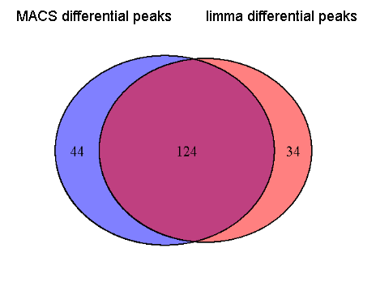

## Outline
# Overview of the presentation

- Background
  - What is ChIP-seq?
  - Overview of problem
- Comparing ChIP-seq data
  - Review of existing methods
  - My Approach
    - Finding differential binding sites
- Results
  - Evaluate method
  - Compare with other methods
- Conclusion


--- 

## Background

# What is ChIP-seq?


- ChIP-seq = High-throughput sequencing + chromatin immunoprecipitation
- Produces millions of short DNA reads that are enriched for DNA-protein interactions


Huber et al, 2006

---
## Background

# What does ChIP-seq look like?

- It's noisey!
- Contains peaks that represent binding sites
- Noise depends on the sequencing depth, relative enrichment

```{r echo=FALSE,message=FALSE,fig.width=12,fig.height=5,warning=FALSE,results='hide'}
require(ProjectTemplate)
od<-setwd('..')

#op<-par(mfrow=c(2,1))
plot(macswiggle[[1]]$control$chr01$V1,macswiggle[[1]]$control$chr01$V2,type='l',col=1,xlab="Chr01 position",ylab="Number of ChIP-seq tags",ylim=c(0,80))
lines(macswiggle[[1]]$treat$chr01$V1,macswiggle[[1]]$treat$chr01$V2,col="#AA2222EE")
#lines(macswiggle[[2]]$control$chr01$V1,macswiggle[[2]]$control$chr01$V2,'l',col=1,xlab="Chr01 position",ylab="Number of ChIP-seq tags",ylim=c(0,80))
lines(macswiggle[[4]]$treat$chr01$V1,macswiggle[[4]]$treat$chr01$V2,col="#2222AA99")
legend('topright',legend=c('S96','HS959'),fill=c('#AA2222','#2222AA'))
title('Distribution of ChIP-seq and control reads (S96 vs HS959)')


setwd(od)
#par(op)
```
--- 


## Background

# Analyzing the data--finding peaks in the data

- Use knowledge about data to build peak model
- Peak model uses distribution of paired-end reads to estimate the size of the DNA fragments
  - Sequencer reads are ~20-50bp
  - Fragment size is between ~100-300bp


Wilbanks et al, 2010


---


## Overview 
# ChIP-seq applications

- ChIP-seq can be used to learn about
  - transcription factor binding sites
  - histone modifications
  - regulatory motifs
- Important to compare datasets from experiments
- Find effects of binding sites regulation on gene expression

    

From http://genome.tbdb.org/annotation/genome/tbdb/RegulatoryNetwork.html

---

## Overview
# Comparing ChIP-seq data


- Binding sites can change between experiments, between species, etc
- Comparing related genomes can provide some insight

 


Odom, Dowell et al. 2007

---


## Goals

- Using replicates
  - High throughput experiments generate lots of data, but replication is needed
  - Many protocols pool replicate experiments together, problems?
- Directly compare data from experiments
  - Can compare overlap of peaks, but this is indirect

--- 

## Problem- How to compare different experiments?

- MACS (Model based analysis of ChIP-seq)
  - Peak finder that compares ChIP-seq to control and uses a Poisson distribution
  - Can compare different conditions by using one as a "false control"
  - $\lambda=$ expected number of tags in scanning window
  


---

## Problem- How to compare different experiments?

- MACS
- DIME (Differential identification using mixture ensemble)
  - Directly compare two experiments as log ratios between 
  - Use mixture model to find differential 'component' of distribution

```{r echo=FALSE,fig.width=13,fig.height=4}
require(RColorBrewer)

ret=brewer.pal(6,"RdBu")
sel=wiggleTableScale[wiggleTableScale[1,]=="chr01",]
op<-par(mfrow=c(1,2))
plot(sel[,2],sel[,3],type='l',col=paste0(ret[1],"EE"),xlab="Chr01 position",ylab="ChIP-seq tags",ylim=c(0,500))
lines(sel[,2],sel[,6],col=paste0(ret[6],"99"))
title('S96 vs HS959 tags distribution')
plot(sel[,2],log(sel[,3]/sel[,6]),xlab="Chr01 position",ylab="Log ratio",col=ret[2],type='l')
title('Log ratio S96/HS959 tags distribution')
par(op)
```
Different views

---
## Problem- How to compare different experiments?

- MACS
- DIME 
- NormDiff
  - Analyze many experiments at once
  - Find variable binding sites
  
  
```{r echo=FALSE}
require(xtable)
names(wiggleTableScale)<-c('Chr','Pos','S96','S96','S96','HS959','HS959','HS959')
head(wiggleTableScale)
```

Table of read scores from multiple ChIP-seq experiments

---

## Problem- How to compare different experiments?

- MACS
- DIME
- NormDiff
- Our method
  - Use t-tests to find differential binding sites in ChIP-seq data


---

## Pros and Cons

- Benefits of t-test approach
  - Includes replicates
  - Evaluates significance and size of differences

- Problems
  - Requires normalization of values
  - There is a large "Background" distribution in chip-seq that is troublesome for t-tests


Equation for Standard t-test with "pooled variance"

---

---
## Solution to normalization--Scaling values

We observe a different read depths in our experiments, so without any scaling they appear to have different distributions

```{r echo=FALSE}
require(RColorBrewer)

palette(brewer.pal(6,"RdBu"))
fl<-c(1,1,1,6,6,6)
boxplot(wiggleTable[,c(-1,-2)], boxwex=0.5, notch=T, main="Before scaling for read depth", outline=FALSE, las=1,col=fl)
```

---
## Solution to normalization--Scaling values

We perform scaling to match the median across all experiments


```{r echo=FALSE}
boxplot(wiggleTableScale[,c(-1,-2)], boxwex=0.5, notch=T, main="After scaling for read depth", outline=FALSE, las=1,col=fl,ylim=c(0,60))
palette("default")
```
- Benefit
  - less aggressive than quantile normalization
- Consideration
  - other algorithms for normalizing based on background distribution are being developed, for example, NCIS


```
---


## Solution to t-test

- Use a "moderated t-test" to account for background distribution
- Adds a small amount of bias estimated from the mean standard deviation across entire dataset


---

## Assumption of normality

- Tested the distributions using QQ-plots
- Log ratio of S96 vs HS959 replicates vs Standard normal


---


## Assumption of normality

- Tested the distributions using QQ-plots
- Log ratio of two S96 replicates vs Standard normal


---


## Performing the t-test

- The moderated t-test estimates based on log-ratios according to a linear model
  - $E[y_g]=X\alpha_g$
- Then the 


---

## Comparing our results to other approaches

- We perform merging for our approach from sites that are close (<20bp away)
- Look at the rate of the merging vs the p-value thresholds


---


## Comparing our results to other approaches

- We perform merging for our approach from sites that are close (<20bp away)
- Look at the rate of the merging vs the p-value thresholds


---


## Results from merging

- Outperforms merging compared with results from DIME
- Has results comparable to MACS which has its own merging algorithm




---


## Compare results with gene expression data

- We can combine ChIP-seq with gene expression data to find the influence of binding sites
- Shows the binding sites influence nearby genes


- Light color indicates correlation with random gene
- Dark color indicates correlation with nearest gene to binding site

--- 

## Future Goals

- Evaluate different merging algorithms
  - TileMap type analysis from CisGenome (Ji et al, 2008) 
  - Use moving average merging
- Do a closer look at NormDiff
- Consider modelling background distribution differently
  - omitting background distributions (Dudoit et al, 2002)
  - modelling local variations like MACS (Zhang et al. 2008)
- Look at other types of Normalizations
  - voom from Smyth et al, used in limma
  - different types of LOESS, used in DIME
  - NCIS scaling methods, modifications to MACS


--- 

## Conclusion

- Thank you for listening!
- Questions?


