## Outline
# Overview of the presentation

- Background
  - What is ChIP-seq?
  - Overview of problem
- Comparing ChIP-seq data
  - Review of existing methods
  - My Approach
    - Finding differential binding sites
- Results
  - Evaluate method
  - Compare with other methods
- Conclusion


--- 

## Background

# What is ChIP-seq?


- ChIP-seq = High-throughput sequencing + chromatin immunoprecipitation
- Produces millions of short DNA reads that are enriched for DNA-protein interactions


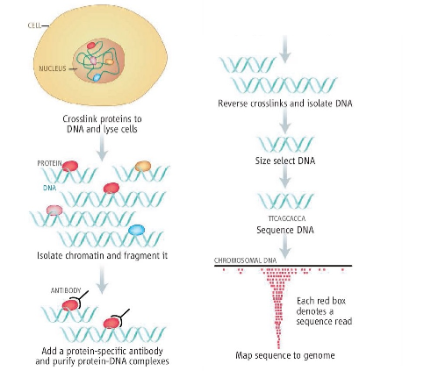
Huber et al, 2006

---
## Background

# What does ChIP-seq look like?

- It's noisey!
- Contains peaks that represent binding sites
- Noise depends on the sequencing depth, relative enrichment

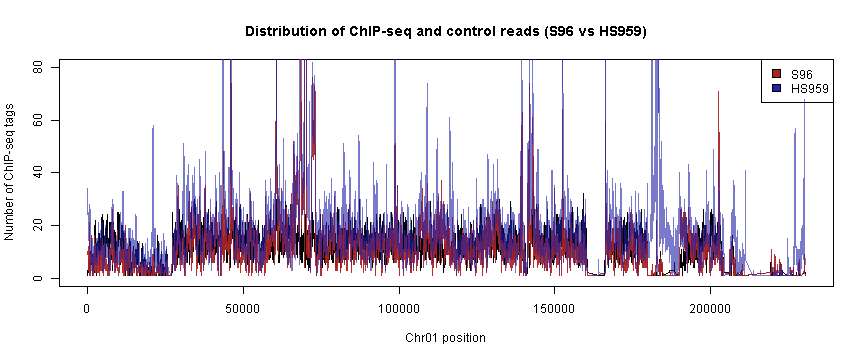 

--- 


## Background

# Analyzing the data--finding peaks in the data

- Use knowledge about data to build peak model
- Peak model uses distribution of paired-end reads to estimate the size of the DNA fragments
  - Sequencer reads are ~20-50bp
  - Fragment size is between ~100-300bp


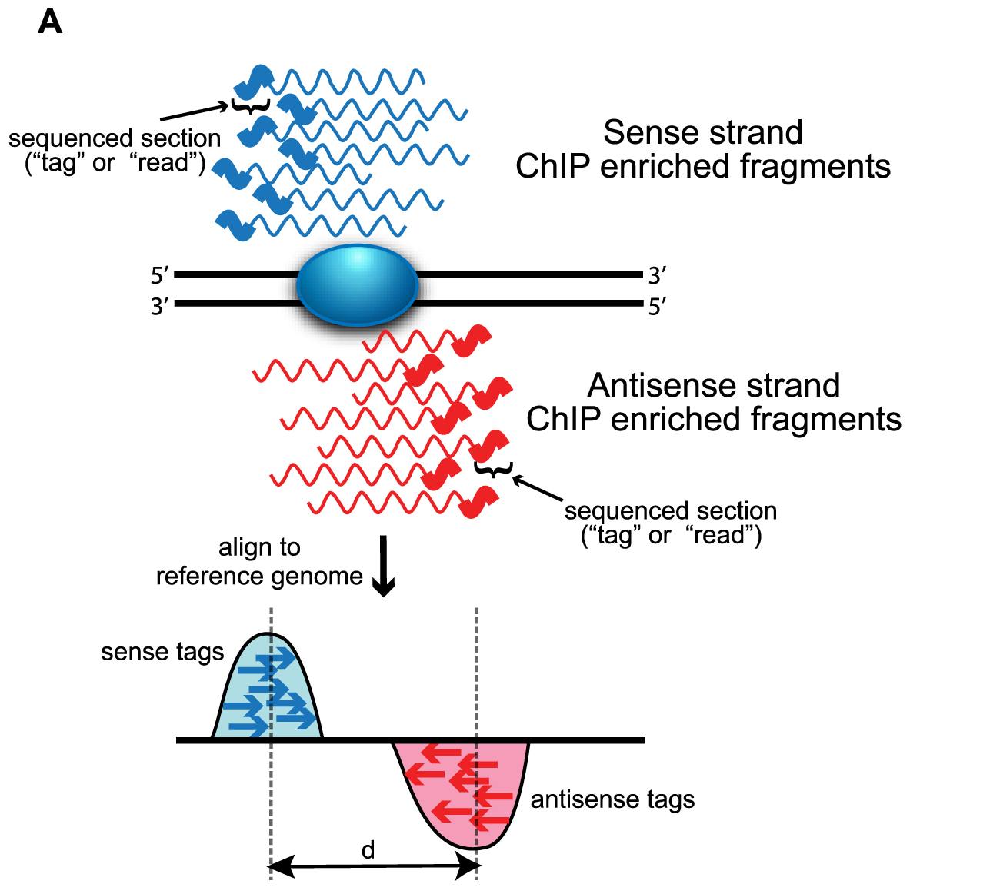

Wilbanks et al, 2010


---


## Overview 
# ChIP-seq applications

- ChIP-seq can be used to learn about
  - transcription factor binding sites
  - histone modifications
  - regulatory motifs
- Important to compare datasets from experiments
- Find effects of binding sites regulation on gene expression

    
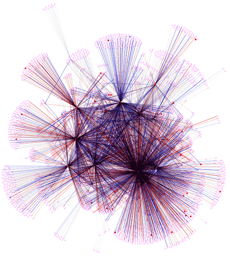
From http://genome.tbdb.org/annotation/genome/tbdb/RegulatoryNetwork.html

---

## Overview
# Comparing ChIP-seq data


- Binding sites can change between experiments, between species, etc
- Comparing related genomes can provide some insight

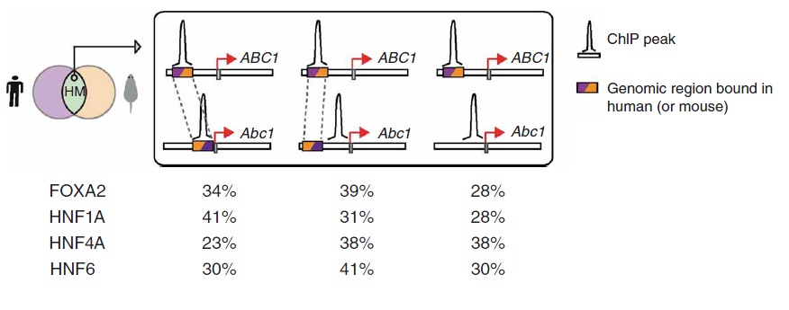 


Odom, Dowell et al. 2007

---


## Goals

- Using replicates
  - High throughput experiments generate lots of data, but replication is needed
  - Many protocols pool replicate experiments together, problems?
- Directly compare data from experiments
  - Can compare overlap of peaks, but this is indirect

---
## Scaling values

We observe a different read depths in our experiments

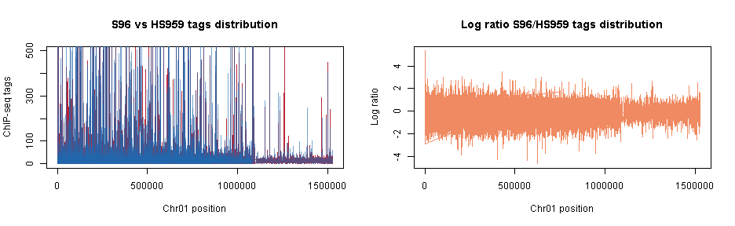 


---
## Scaling values

Then we perform scaling to match the median value across all experiments
- scales up or down according to the average median read depth

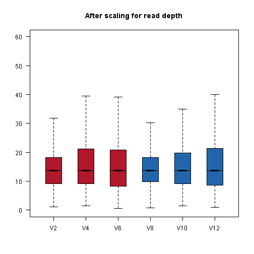 

---

## Problem- How to compare different experiments?

- MACS (Model based analysis of ChIP-seq)
  - Peak finder that compares ChIP-seq to control and uses a Poisson distribution
  - Can compare different conditions by using one as a "false control"
  - $\lambda=$ expected number of tags in scanning window
  
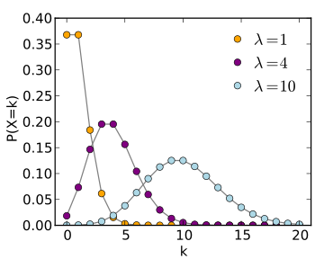

---

## Problem- How to compare different experiments?

- MACS
- DIME (Differential identification using mixture ensemble)
  - Directly compare two experiments as log ratios between 
  - Use mixture model to find differential 'component' of distribution

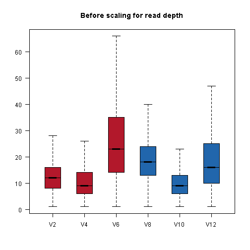 

Different views

---
## Problem- How to compare different experiments?

- MACS
- DIME 
- NormDiff
  - Analyze many experiments at once
  - Find variable binding sites
  
  

```
##     Chr Pos   S96   S96   S96 HS959  HS959 HS959
## 1 chr01  51 11.37 30.31 22.53 25.76 110.63 77.57
## 2 chr01  61 11.37 27.28 22.53 25.76 110.63 80.13
## 3 chr01 121 11.37 24.25 21.94 20.46  56.07 73.31
## 4 chr01 131 10.23 24.25 21.94 18.19  54.56 72.46
## 5 chr01 141 10.23 22.73 20.16 18.94  50.01 65.64
## 6 chr01 151 10.23 18.19 21.94 18.94  46.98 61.38
```


Table of read scores from multiple ChIP-seq experiments

---

## Problem- How to compare different experiments?

- MACS
- DIME
- NormDiff
- Our method
  - Use t-tests to find differential binding sites in ChIP-seq data


---

## Pros and Cons

- Benefits of approach
  - Includes replicates
  - Evaluates significance and size of differences

- Cons
  - There is a large "Background" distribution in chip-seq that is troublesome for t-tests


Standard t-test

---

## Solution to t-test

- Use a "moderated t-test" to account for background distribution
- Adds a small amount of bias estimated from the mean standard deviation across entire dataset


---

## Assumption of normality

- Tested the distributions using QQ-plots

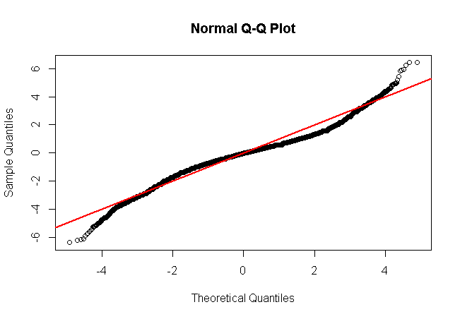


---


## Assumption of normality

- Tested the distributions using QQ-plots

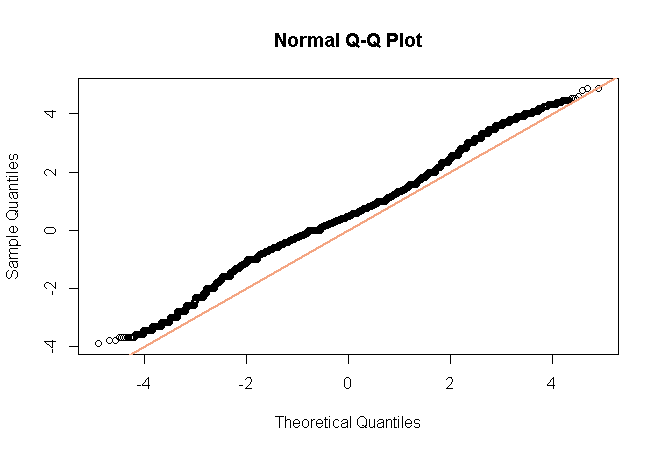


---


## Performing the t-test

- Estimate the log ratios from the replicate data along with significance using t-tests

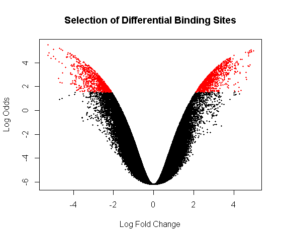


---

## Comparing our results to other approaches

- We obtain many differential genome positions which we merge together
- MACS automatically performs merging of the scanning windows into peaks
- We perform merging for our approach from sites that are close (<20bp away)
- Look at the rate of the merging vs the p-value thresholds

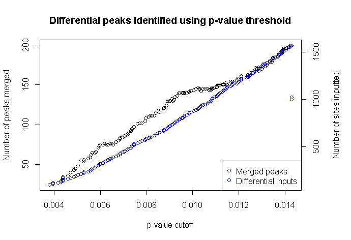

---


## Comparing our results to other approaches

- We obtain many differential genome positions which we merge together
- MACS automatically performs merging of the scanning windows into peaks
- We perform merging for our approach from sites that are close (<20bp away)
- Look at the rate of the merging vs the p-value thresholds

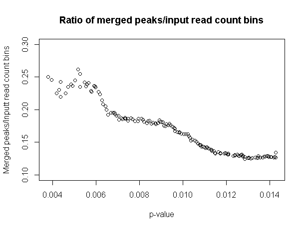


---


## Compare results with gene expression data

- We can combine ChIP-seq with gene expression data to find the influence of binding sites

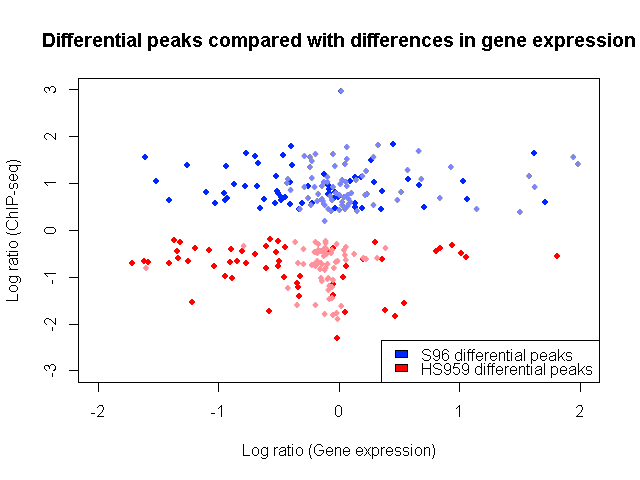


--- 

## Conclusion

- Thank you for listening!
- Questions?


